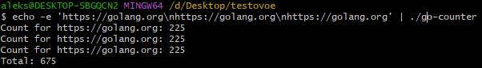

Тестовое задание
# go-counter
Процессу на stdin приходят строки, содержащие URL или названия файлов. Каждый такой URL нужно запросить, каждый файл нужно прочитать, и посчитать кол-во вхождений строки "Go" в ответе. В конце работы приложение выводит на экран общее кол-во найденных строк "Go" во всех источниках данных, например:
```
$ echo -e 'https://golang.org\n/etc/passwd\nhttps://golang.org\nhttps://golang.org' | ./go-counter
Count for https://golang.org: 9
Count for /etc/passwd: 0
Count for https://golang.org: 9
Count for https://golang.org: 9
Total: 27

```
Каждый источник данных должен начать обрабатываться сразу после вычитывания и параллельно с вычитыванием следующего. Источники должны обрабатываться параллельно,но не более k=5 одновременно. Обработчики данных не должны порождать лишних горутин, т.е. если k=1000 а обрабатываемых источников нет, не должно создаваться 1000 горутин. Нужно обойтись без глобальных переменных и использовать только стандартные библиотеки.

И еще одно напутствие: представь, что это рабочая задача, а не домашка с курса. что надо реально для общего использования сделать эту cli тулзу и ей народ будет пользоваться. надо продумать корнеркейсы и что может пойти не так. код должен быть опрятным, чтоб его потом могли читать и править коллеги.

Пример выполнения программы:
